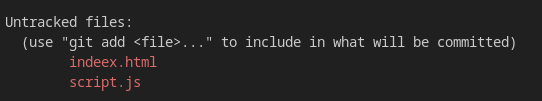

### Git & Github
No Git, existem diversos códigos e comandos usados para versionamento de código. Aqui estão alguns dos mais usados e suas funções:
O Git é uma ferramenta essencial para o versionamento de códigos, amplamente utilizada em projetos de software. Abaixo estão descritos os principais comandos e técnicas para utilizá-lo de forma eficiente. É um sistema que grava as mudanças feitas em nossos arquivos ao longo do tempo por meio de “snapshots”

---

Instalação

windows: [git para windows](https://git-scm.com/downloads/win)

Linux:

```bash
sudo apt-get install git 
sudo dnf install git
```

MacOs:

```jsx
brew install git
```

Resolvendo problemas de mensagens

```jsx
hint: Using 'master' as the name for the initial branch. This default branch name
hint: is subject to change. To configure the initial branch name to use in all
hint: of your new repositories, which will suppress this warning, call:
hint:
hint:   git config --global init.defaultBranch <name>
hint:
hint: Names commonly chosen instead of 'master' are 'main', 'trunk' and
hint: 'development'. The just-created branch can be renamed via this command:
hint:
hint:   git branch -m <name>
```

Adicione:

```jsx
git config --global init.defaultBranch main
// renomear branch
git branch -m main
// atualizar o repositorio remoto 
git push -u origin main
```

Arquivos **UNTRACKED** são aqueles que ainda não estão preparados para commit mas que têm modificações



Retirar um arquivo da área de stage :

```jsx
git rm —cached index.html
```

Ignorar arquivos

 1. **Configuração Inicial**

- git config --global user.name "Seu Nome": Configura o nome do usuário.

- git config --global user.email "seu.email@dominio.com": Configura o email do usuário.

 2. **Criação e Inicialização de Repositório****

- git init: Inicializa um novo repositório Git em um diretório.

- git clone <url>: Clona um repositório remoto para o seu ambiente local.

 3. **Gerenciamento de Arquivos****

- git add <arquivo>: Adiciona um arquivo para o próximo commit.

- git add .: Adiciona todas as mudanças feitas no diretório.

- git rm <arquivo>: Remove um arquivo do repositório e do diretório local.

 4. **Committing (Salvamento de Alterações)****

- git commit -m "mensagem": Faz um commit das mudanças adicionadas com uma mensagem descritiva.

- git commit --amend: Altera o último commit (útil para corrigir mensagens ou adicionar arquivos).

 5. **Visualização do Histórico****

- git log: Mostra o histórico de commits.

- git log --oneline: Mostra o histórico de commits de forma compacta.

- git diff: Mostra as diferenças entre arquivos modificados mas ainda não commitados.

- git status: Mostra o estado dos arquivos (modificados, adicionados, deletados).

 6. **Branching e Merging (Trabalhando com Ramificações)****

- git branch: Mostra as branches (ramificações) do projeto.

- git branch <nome-branch>: Cria uma nova branch.

- git checkout <nome-branch>: Muda para uma branch específica.

- git merge <nome-branch>: Mescla a branch especificada com a branch atual.

 7. **Trabalho Remoto (Repositórios Remotos)****

- git remote add origin <url>: Adiciona um repositório remoto.

- git push origin <branch>: Envia os commits para o repositório remoto.

- git pull: Puxa as atualizações do repositório remoto e as mescla no repositório local.

 8. **Stash (Armazenamento Temporário)****

- git stash: Salva temporariamente mudanças que não estão prontas para serem commitadas.

- git stash apply: Restaura as mudanças que foram salvas com git stash.

 9. **Rebase e Cherry-Pick**

- git rebase <branch>: Reaplica commits da branch atual em cima da branch especificada.

- git cherry-pick <commit>: Aplica um commit específico de outro branch na branch atual.

 10. **Reset e Revert (Desfazer Alterações)**

- git reset --hard <commit>: Reseta para um commit específico, apagando as mudanças feitas após ele.

- git revert <commit>: Reverte as mudanças de um commit específico, criando um novo commit com a reversão.

Esses são os principais comandos para manipular e versionar código no Git.

O Git oferece diversos recursos avançados que permitem um controle mais refinado e otimizado do versionamento de código. Esses comandos e técnicas são utilizados em cenários mais complexos, geralmente quando se trabalha com grandes equipes ou se deseja maior controle sobre o histórico de commits e fluxo de trabalho. A seguir, estão alguns dos usos avançados mais importantes em Git:

 1. **Squash (Unir Commits)**

- ****Objetivo****: Combina vários commits em um só, tornando o histórico de commits mais limpo e coeso.

- ****Comando****: Durante o rebase interativo (git rebase -i <commit>) você pode marcar commits com squash (ou s) para combiná-los em um único commit.

bash

``git rebase -i HEAD~3`` # Exemplo: combinando os últimos 3 commits


 2. **Rebase (Reaplicar Commits)**

- ****Objetivo****: Move ou reaplica commits de uma branch sobre outra, criando um histórico linear e evitando merges com commits adicionais.

- ****Comando****: git rebase <branch>

- Exemplo:

bash

``git checkout feature-branch``

``git rebase main``
`

Isso reaplicaria todos os commits da feature-branch sobre a main.

 3. **Cherry-Pick (Aplicar Commits Selecionados)**

- ****Objetivo****: Permite aplicar um commit específico de uma branch em outra sem mesclar todo o conteúdo.

- ****Comando****:``git cherry-pick <commit>``

Exemplo:

bash

``git cherry-pick abc1234`` # Commit específico de outra branch


 4. **Bisect (Buscar Commits com Erros)**

- ****Objetivo****: Ajuda a encontrar qual commit introduziu um bug ou falha. É um processo de busca binária que testa commits até encontrar o culpado.

- ****Comando****: ``git bisect start``

- Passos:

1. Marcar o commit com bug: ``git bisect bad``

2. Marcar um commit funcional: ``git bisect good <commit>``

3. Git irá iterar entre os commits até encontrar o causador do bug.

 5. **Submodules (Módulos Git dentro de Git)**

- ****Objetivo****: Gerencia repositórios Git dentro de outros repositórios, útil para projetos que dependem de bibliotecas externas ou subprojetos.

- ****Comando****: git submodule add <url> <caminho>

- Exemplo:

bash

``git submodule add https://github.com/exemplo/repo caminho/para/repo``


Para atualizar submódulos: git submodule update --init --recursive

 6. **Worktrees (Trabalhar com Múltiplas Branches no Mesmo Repositório)**

- ****Objetivo****: Permite criar múltiplas cópias (worktrees) de um repositório Git, cada uma em uma branch diferente, sem precisar de clones extras.

- ****Comando****: git worktree add <pasta> <branch>

Exemplo:

bash

git worktree add ../nova-branch feature-branch


 7. **Hooks (Automação de Tarefas)**

- ****Objetivo****: Git hooks são scripts que podem ser executados automaticamente em certos eventos, como pre-commit, post-merge, ou pre-push. São úteis para automações como linting, testes automatizados ou integração contínua.

- Exemplo de script pre-commit:

Crie o arquivo .git/hooks/pre-commit e insira um script para rodar testes antes de cada commit.

 8. **Reflog (Recuperação de Commits Perdidos)**

- ****Objetivo****: Registra todas as mudanças feitas no repositório local, inclusive aquelas que não aparecem no git log, como commits que foram "perdidos" após um reset ou rebase.

- ****Comando****: git reflog

Exemplo:

bash

git reflog  # Ver histórico de todos os commits e referências

git checkout HEAD@{3}  # Retorna ao estado anterior de 3 referências atrás


 9. **Reset vs. Revert vs. Checkout (Gerenciamento de Histórico)**

- ****Reset****:

- Move o ponteiro do branch e, dependendo da opção, altera o estado da working directory.

- git reset --soft <commit>: Mantém as mudanças no stage.

- git reset --hard <commit>: Desfaz tudo (inclusive as mudanças locais).

- ****Revert****:

- Cria um novo commit que desfaz as alterações de um commit anterior sem modificar o histórico.

- git revert <commit>

- ****Checkout****:

- Alterna entre branches ou restaura arquivos.

- git checkout <branch> ou git checkout <arquivo>

 10. **Blame (Atribuir Autores a Linhas de Código)**

- ****Objetivo****: Ver quem modificou cada linha de um arquivo e em qual commit, facilitando a rastreabilidade de alterações.

- ****Comando****: ``git blame <arquivo>``

Exemplo:

bash

git blame README.md  # Mostra o autor e o commit de cada linha do arquivo README


 11. **Tagging (Versões e Releases)**

- ****Objetivo****: Tags são usadas para marcar commits importantes, como lançamentos de versões.

- ****Comando****: ``git tag <versao>``ou``git tag -a <versao> -m "Mensagem"``

Exemplo:

bash

``git tag v1.0.1``  # Criar tag simples

``git tag -a v1.0.0 -m "Lançamento da versão 1.0.0"`` # Criar tag anotada


Para enviar as tags para o repositório remoto:``git push origin --tag``

 12. **Patch (Aplicar Diferenças em Código)**

- ****Objetivo****: Gera um arquivo de diferenças (patch) entre commits ou branches que pode ser aplicado em outro repositório ou branch.

- ****Comando****:``git format-patch <branch> e git apply <patch-file>``

Exemplo:

bash

``git format-patch origin/main``  # Gera patches desde a branch main

``git apply meu-patch.patch``  # Aplica o patch


 1.  **GPG Commit Signing (Assinatura de Commits)**

- ****Objetivo****: Permite assinar commits com uma chave GPG para garantir sua autenticidade.

- ****Comando****: ``git commit -S -m "mensagem"``
`
Exemplo:

bash

``git commit -S -m "Commit assinado``


14. **Filter-Branch (Reescrever Histórico Completo)**

- ****Objetivo****: Reescreve o histórico de commits do repositório, útil para remover dados sensíveis ou renomear arquivos em todo o histórico.

- ****Comando****: git filter-branch

Exemplo:

bash

``git filter-branch --tree-filter 'rm -rf arquivos_sensiveis/' HEAD~``


Essas técnicas avançadas são usadas por desenvolvedores experientes para manter um histórico de commits limpo, eficiente e colaborativo, especialmente em equipes grandes e em projetos de longa duração.

**Estruturas de mensagem de um commit**

Seguir padrões de nomenclatura e boas práticas para mensagens de commit no Git é fundamental para manter um histórico de commits claro e compreensível. Aqui estão algumas diretrizes e convenções comuns para escrever mensagens de commit eficazes:

1. **Estrutura da Mensagem de Commit**

Uma mensagem de commit geralmente é composta por três partes principais:

- ****Cabeçalho****: Uma linha curta que resume a mudança (até 50 caracteres).

- ****Corpo**** (opcional): Uma descrição mais detalhada das mudanças, incluindo o "porquê" e "como" das alterações. O corpo deve ser separado do cabeçalho por uma linha em branco e não deve exceder 72 caracteres por linha.

- ****Rodapé**** (opcional): Informações adicionais, como referências a issues ou tarefas relacionadas.

****Exemplo****:

Adiciona suporte para autenticação de usuário

- Implementa a autenticação JWT

- Adiciona testes unitários para o módulo de autenticação

- Atualiza a documentação sobre o fluxo de autenticação

Relacionado a: #123


 2. **Uso de Verbos no Imperativo**

As mensagens de commit devem ser escritas no imperativo, como se você estivesse dando uma ordem. Isso ajuda a transmitir claramente a ação que o commit realiza.

****Exemplos****:

- ****Correto****: "Adiciona nova funcionalidade de busca"

- ****Incorreto****: "Adicionado nova funcionalidade de busca"
- 
 3. **Mensagens Curta e Clara**

- O cabeçalho deve ser curto e claro, descrevendo a mudança principal. Evite mensagens vagas como "Atualizações" ou "Correções".

 4. **Incluir Referências a Problemas ou Tarefas**

Quando aplicável, inclua referências a problemas (issues) ou tarefas relacionadas no rodapé. Isso ajuda a rastrear as mudanças em relação a bugs ou funcionalidades.

****Exemplo****:

Corrige erro na função de login

Relacionado a: #456


 5. **Seja Específico**

Forneça detalhes suficientes no corpo da mensagem para que outros desenvolvedores possam entender a mudança sem ter que investigar o código.

 6. **Use Categorias**

Em projetos maiores, pode ser útil usar categorias no cabeçalho para identificar rapidamente o tipo de mudança. Algumas categorias comuns incluem:

- feat: Adição de uma nova funcionalidade.

- fix: Correção de um bug.

- docs: Mudanças na documentação.

- style: Mudanças que não afetam a lógica do código (formatação, estilo, etc.).

- refactor: Alterações na estrutura do código sem alteração de funcionalidades.

- test: Adição ou correção de testes.

- chore: Tarefas menores que não se enquadram nas categorias acima.

****Exemplo****:

feat: Adiciona suporte para múltiplos idiomas

fix: Corrige falha ao carregar a página de perfil


 7. **Revisão e Consistência**

- Revise suas mensagens de commit antes de confirmar, para garantir clareza e precisão.

- Mantenha um estilo consistente ao longo do projeto. Se um padrão é estabelecido, todos devem segui-lo.

 8. **Commit em Tamanhos Apropriados**

- Evite fazer commits que incluem muitas alterações não relacionadas. Cada commit deve representar uma única mudança ou um conjunto coerente de mudanças relacionadas.

 9. **Dividir Commits em Etapas Lógicas**

- Se uma funcionalidade é complexa, considere dividir o trabalho em múltiplos commits que representem etapas lógicas, facilitando a revisão e o rastreamento de mudanças.

 10. **Exemplo de Mensagens de Commit**

plaintext

feat: Adiciona funcionalidade de pesquisa no produto

- Implementa busca por nome e categoria

- Atualiza interface de usuário para incluir campo de pesquisa

- Adiciona testes para a nova funcionalidade

Relacionado a: #34

fix: Corrige erro de carregamento da página

- Resolve problema que causava falha ao carregar dados de usuários


Seguir essas diretrizes pode ajudar a melhorar a comunicação dentro da equipe e facilitar a compreensão do histórico do projeto ao longo do tempo.

Mencionar o início de um projeto em uma mensagem de commit deve ser feito de forma clara e concisa. Aqui estão algumas boas práticas e um exemplo para te ajudar a escrever uma mensagem de commit que indique o início de um novo projeto:

**Estrutura da Mensagem**

1. ****Cabeçalho****: Utilize um verbo no imperativo e mencione que é o início do projeto.

2. ****Corpo**** (opcional): Forneça mais detalhes sobre o projeto, como seu objetivo ou visão.

3. ****Rodapé**** (opcional): Incluir referências, como a issue que iniciou o projeto (se aplicável).

** Exemplo de Mensagem de Commit**

plaintext

feat: inicia o projeto de gestão de tarefas

- Configura o repositório inicial com arquivos básicos
- Adiciona a estrutura de diretórios do projeto
- Implementa README inicial com descrição do projeto

Relacionado a: #1


**Dicas Adicionais**

- ***Use Categorias****: O uso de categorias como feat para novas funcionalidades é uma boa prática.
- ***Seja Descritivo****: Especifique o que foi feito além de iniciar o projeto, como configuração de ambiente, arquivos criados, etc.
- ***Data e Contexto****: Se o projeto está relacionado a um prazo ou meta, mencionar isso no corpo pode ser útil.

Seguindo essas orientações, suas mensagens de commit ficarão claras e informativas, facilitando a colaboração com outros desenvolvedores.

Para entrar no modo de edição de uma mensagem de commit no Git, você pode usar o seguinte comando:

** Editar a Mensagem do Último Commit**

Se você deseja editar a mensagem do último commit, use:

bash

``git commit --amend``


Esse comando abrirá o editor de texto padrão do Git, onde você pode editar a mensagem do commit. Após fazer suas alterações, salve o arquivo e feche o editor. A nova mensagem será aplicada ao último commit.

**Editar Mensagem de um Commit Específico**

Se você precisa editar a mensagem de um commit específico que não é o último, siga estes passos:

1. ****Rebase Interativo****:

Use o comando de rebase interativo para acessar os commits anteriores:

bash

``git rebase -i HEAD~``


Onde n é o número de commits que você deseja ver (por exemplo, HEAD~3 para ver os últimos 3 commits).

2. ****Escolher o Commit para Editar****:

No editor que abrir, você verá uma lista dos últimos n commits. Altere a palavra pick para reword (ou apenas r) na linha do commit cuja mensagem você deseja editar.

plaintext

reword 1234567 Mensagem do commit

pick   abcdef0 Outro commit


3. ****Salvar e Fechar o Editor****:

Salve as alterações e feche o editor. O Git abrirá novamente o editor para que você possa editar a mensagem do commit selecionado.

4. ****Finalizar o Rebase****:

Após editar a mensagem e salvar, o Git aplicará as alterações. Se não houver conflitos, o rebase será concluído.

**Observações**

- ***Cuidado com o Rebase****: O rebase modifica o histórico de commits. Evite usá-lo em branches que já foram compartilhadas com outros, pois isso pode causar problemas de sincronização.
- ***Editor de Texto****: O editor que abre pode variar (pode ser vim, nano, etc.), dependendo da configuração do seu Git. Para mudar o editor padrão, você pode usar:

bash

``git config --global core.editor <editor>``


Substitua <editor> pelo editor desejado, como nano, vim ou code --wait (para Visual Studio Code).